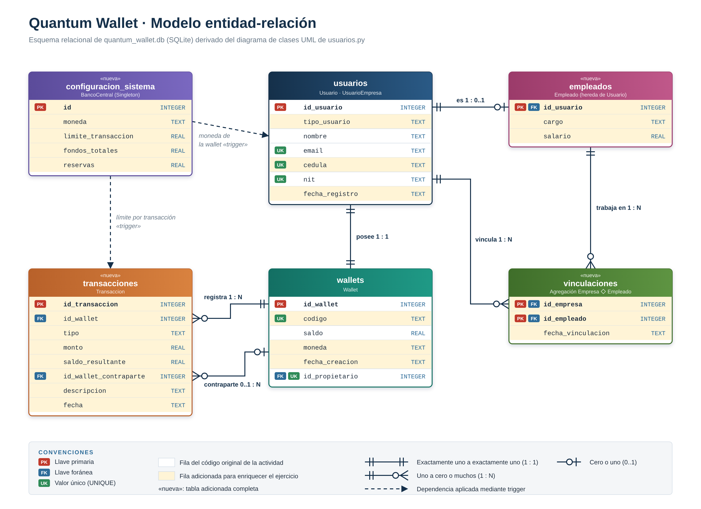

# Semana 7 · Actividad 1 — Arquitectura de bases de datos: persistencia de la Quantum Wallet

Esquema relacional en **SQLite** construido a partir del diagrama de clases UML de `usuarios.py`
(Semana 6). El script `configurar_db.py` crea la base `quantum_wallet.db`, inserta datos de prueba
y verifica las restricciones de integridad.

El trabajo parte del código original de la actividad (enunciado de Canvas y repositorio del curso):
tablas `usuarios` y `wallets`, llave primaria, llave foránea `id_propietario` y saldo `REAL`. Todo
eso se conserva. Para enriquecer el ejercicio se **adicionaron** columnas, cuatro tablas, índices,
vistas y triggers, de modo que el esquema cubra todas las clases del modelo UML.



## Archivos

| Archivo | Contenido |
|---|---|
| `configurar_db.py` | Crea el esquema, inserta los datos de prueba y ejecuta las verificaciones |
| `quantum_wallet.db` | Base de datos SQLite generada por el script |
| `consultas_verificacion.sql` | Consultas de comprobación para la consola de SQLite |
| `diagrama_er_quantum_wallet.drawio` | Modelo entidad-relación editable (Draw.io Integration en VS Code) |
| `diagrama_er_quantum_wallet.png` / `.svg` | Exportaciones del modelo |
| `Semana7_Actividad1_Bases_de_Datos_Deibis_Zuluaga.pdf` | Informe técnico |

## Del modelo de clases a las tablas

| Clase (Semana 6) | Tabla | Origen | Relación |
|---|---|---|---|
| `Usuario`, `UsuarioEmpresa` | `usuarios` | Original, ampliada | Jerarquía en una tabla con `tipo_usuario` |
| `Wallet` | `wallets` | Original, ampliada | Composición `usuarios` 1 : 1 `wallets` |
| `Transaccion` | `transacciones` | **Adicionada** | Composición `wallets` 1 : N `transacciones` |
| `Empleado` | `empleados` | **Adicionada** | Herencia: la PK también es FK a `usuarios` |
| `UsuarioEmpresa ◇ Empleado` | `vinculaciones` | **Adicionada** | Agregación N : M con llave primaria compuesta |
| `BancoCentral` (Singleton) | `configuracion_sistema` | **Adicionada** | Una sola fila permitida (`CHECK (id = 1)`) |

## Columnas por tabla

| Tabla | Columnas del código original | Columnas adicionadas |
|---|---|---|
| `usuarios` | `id_usuario` (PK), `nombre`, `email`, `nit` | `tipo_usuario`, `cedula`, `fecha_registro` |
| `wallets` | `id_wallet` (PK), `saldo` REAL, `id_propietario` (FK) | `codigo`, `moneda`, `fecha_creacion` |
| `transacciones` | — | `id_transaccion` (PK), `id_wallet` (FK), `tipo`, `monto`, `saldo_resultante`, `id_wallet_contraparte` (FK), `descripcion`, `fecha` |
| `empleados` | — | `id_usuario` (PK y FK), `cargo`, `salario` |
| `vinculaciones` | — | `id_empresa` y `id_empleado` (PK compuesta, ambas FK), `fecha_vinculacion` |
| `configuracion_sistema` | — | `id` (PK), `moneda`, `limite_transaccion`, `fondos_totales`, `reservas` |

## Restricciones de integridad

| Restricción | Regla que protege |
|---|---|
| `FOREIGN KEY ... ON DELETE CASCADE` | Al borrar un usuario se borran su wallet y su historial (composición) |
| `UNIQUE (id_propietario)` | Un usuario no puede tener dos wallets (1 : 1) |
| `CHECK (saldo >= 0)` | Ningún pago deja la wallet en negativo |
| `CHECK` sobre `tipo_usuario` y `nit` | Solo las empresas tienen NIT y toda empresa lo tiene |
| `UNIQUE` en `email`, `cedula`, `nit` | No se repiten identificaciones |
| `trg_usuario_crea_wallet` | Cada usuario nuevo recibe su wallet, como en `Usuario.__init__()` |
| `trg_transaccion_valida_limite` | Equivale a `BancoCentral.validar_monto()` |
| `trg_empleado_valida_tipo`, `trg_vinculacion_valida_empresa` | Solo empleados tienen ficha y solo empresas vinculan |

> **Llaves foráneas en SQLite**
> SQLite trae la verificación de llaves foráneas apagada. `configurar_db.py` ejecuta
> `PRAGMA foreign_keys = ON;` en cada conexión; sin esa línea las FK no se validan.

## Requisitos

- Python 3 (el módulo `sqlite3` viene incluido).
- SQLite 3 para la consola (opcional; en macOS se puede instalar con `brew install sqlite`).
- Extensión **SQLite Viewer** en Visual Studio Code para visualizar la base.

```bash
sqlite3 --version
python3 -c "import sqlite3; print('SQLite listo para Python -', sqlite3.sqlite_version)"
```

## Cómo ejecutar

```bash
python3 configurar_db.py
```

El script borra y vuelve a crear `quantum_wallet.db`, de modo que se puede ejecutar las veces
que sea necesario.

**Salida esperada (resumida):**

```
[2] Estructura creada
    Tablas (6): configuracion_sistema, empleados, transacciones, usuarios, vinculaciones, wallets
    Indices (2) · Triggers (4) · Vistas (3)

[3] Datos de prueba
      1  Ana Torres   PERSONA   W-00001       220,000.50 COP
      2  Bancolombia  EMPRESA   W-00002       300,000.00 COP
      3  Quantum SAS  EMPRESA   W-00003     2,300,000.00 COP
      4  Laura Gomez  EMPLEADO  W-00004     4,349,999.50 COP
      5  Pedro Rios   EMPLEADO  W-00005     3,200,000.00 COP
    Conciliacion saldo vs. historial: correcta en todas las wallets

[4] Pruebas de integridad (todas deben ser RECHAZADAS)
    Resultado: 8 de 8 operaciones invalidas rechazadas

[5] AUTOINCREMENT y borrado en cascada
    Se creo y se borro el usuario 6; wallets huerfanas: 0
    El siguiente usuario recibio el id 7 (el 6 no se reutiliza)
```

## Verificación desde la consola de SQLite

```bash
sqlite3 quantum_wallet.db ".read consultas_verificacion.sql"
```

Muestra la versión de SQLite, los objetos del esquema, las llaves foráneas de `wallets`, los
saldos, la nómina, el historial de movimientos y el resultado de `PRAGMA foreign_key_check`.

## Visualización

En Visual Studio Code, con la extensión **SQLite Viewer**, se abre `quantum_wallet.db` desde el
explorador y se recorren las tablas. También se puede cargar el archivo en
<https://inloop.github.io/sqlite-viewer/>.
